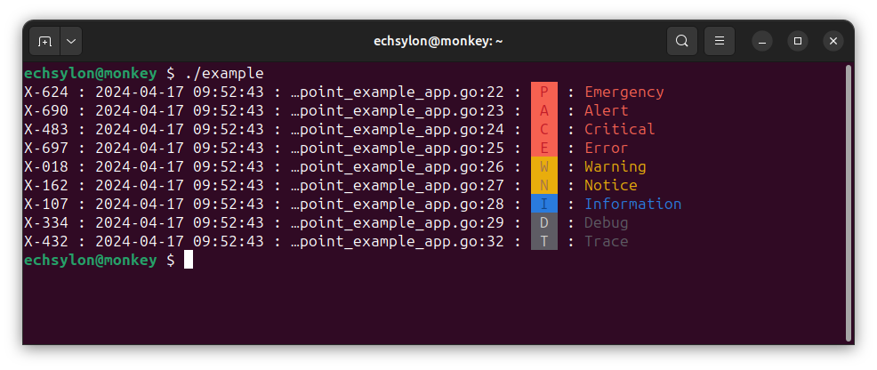

# A nicer command line logger for GO.
This library provides a nice and convenient way for GO application developers to handle log printing in their applications. It will try to print colorful logs if allowed by default, allowing you to disable this manually where it fails.

You install the library by:

```shell
go get github.com/echsylon/go-log
```

## Key features

* Option to log in all Unix Syslog categories (`EMERGENCY`, `ALERT`, `CRITICAL`, `ERROR`, `WARNING`, `NOTICE`, `INFORMATIONAL`, `DEBUG`) and additionally also  `TRACE`.
* Configurable log details (supports injecting custom details).
* Color coded output.

## A concrete example

Below example code:

```go
package main

import (
	"fmt"
	"math/rand"

	"github.com/echsylon/go-log"
)

func main() {
	// Configure log environment
	log.SetLogLevel(log.LOG_LEVEL_TRACE)
	log.SetLogColumnSeparator(" : ")
	log.SetLogColumns(
		customLogColumn,
		log.LOG_COLUMN_DATETIME,
		log.LOG_COLUMN_SOURCE,
		log.LOG_COLUMN_LEVEL,
	)

	// Print standard Syslog categories
	log.Emergency("Emergency")
	log.Alert("Alert")
	log.Critical("Critical")
	log.Error("Error")
	log.Warning("Warning")
	log.Notice("Notice")
	log.Information("Information")
	log.Debug("Debug")

	// Print debug trace category.
	log.Trace("Trace")
}

func customLogColumn() string {
	// Produce custom log information on the form "X-nnn",
	// where "nnn" is a random integer between 0 and 1000.
	n := rand.Intn(1000)
	return fmt.Sprintf("X-%03d", n)
}
```


...would output something like this (Ubuntu 23.10):


